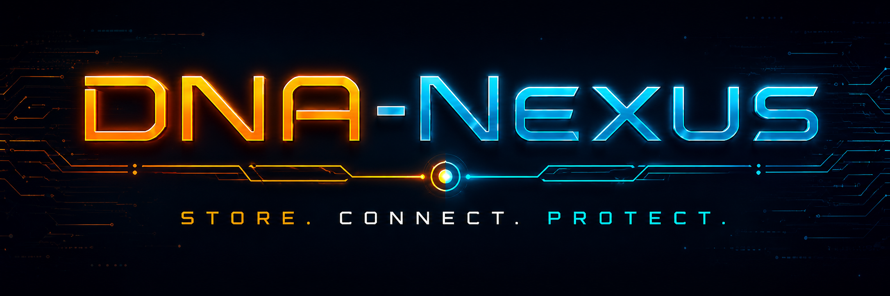
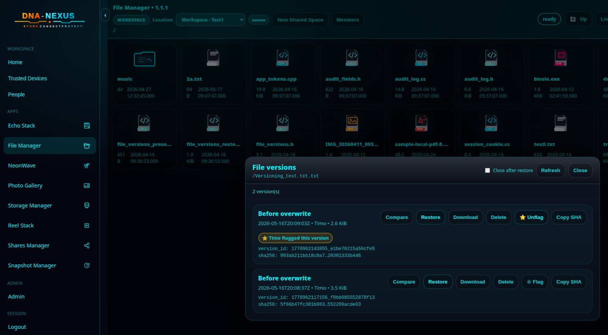
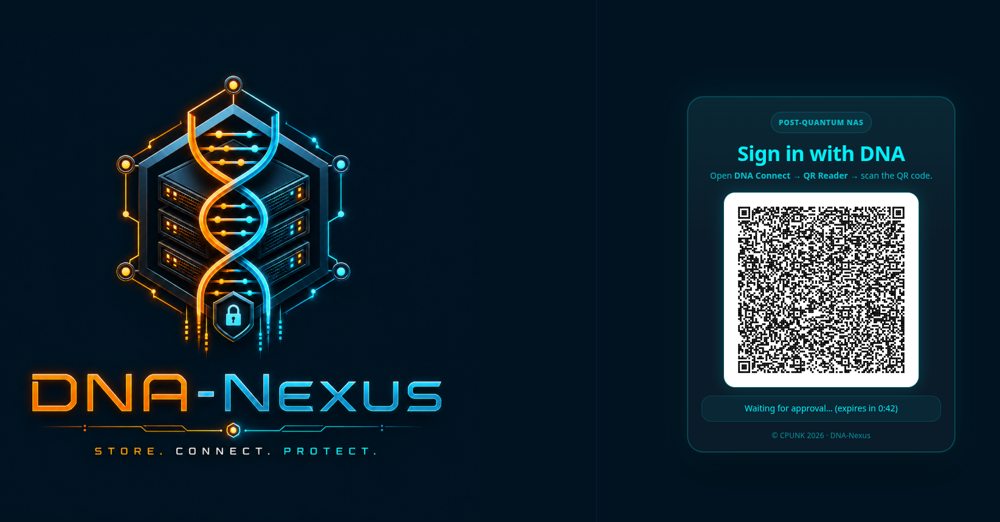
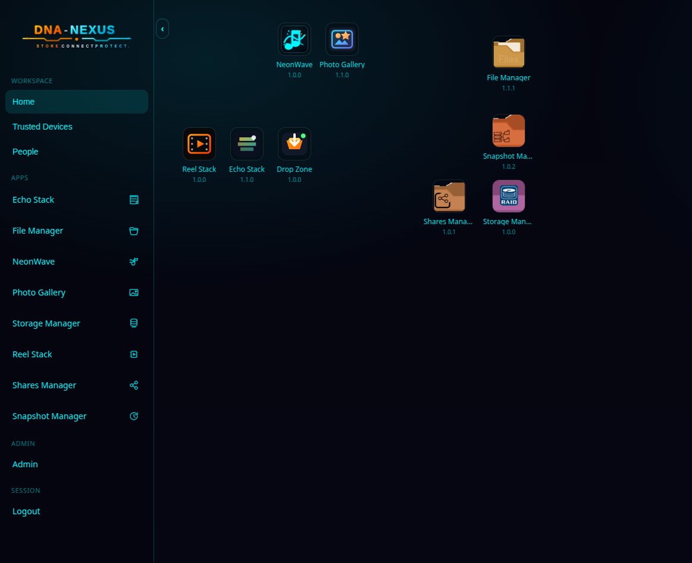
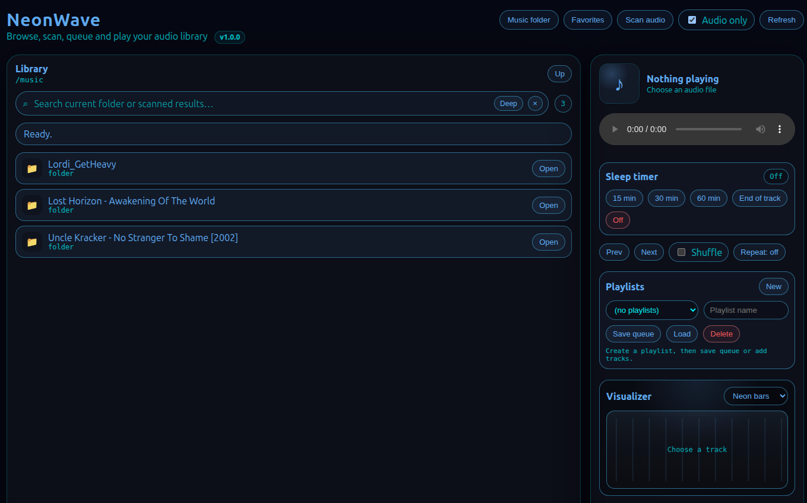

  

# DNA-Nexus

**DNA-Nexus** is a private NAS and collaboration platform focused on user-controlled storage, secure sharing, and self-hosted cloud services.

The goal is to give users a friendly alternative to traditional cloud storage: files, photos, videos, workspaces, public upload links, and mobile access — all running on infrastructure the owner controls.

## Projects

### DNA-Nexus Server

The main Linux server / NAS platform.

Repository: [DNA-Nexus/pq-nas](https://github.com/DNA-Nexus/pq-nas)

Current focus areas include:

- File Manager
- Photo Gallery
- Workspace sharing
- External workspace access
- Drop Zone public uploads
- Echo Stack bookmark and web archive app
- Reel Stack video gallery
- Admin tools and user management
- Theme-aware app platform

### DNA-Nexus Mobile

Android companion app for connecting to DNA-Nexus Server.

Repository: [DNA-Nexus/PQ-NAS-Mobile](https://github.com/DNA-Nexus/PQ-NAS-Mobile)

## Vision

DNA-Nexus is built around a simple idea:

> Your files, your server, your rules.

Instead of depending completely on large cloud providers, users should be able to run powerful, understandable, and private services on their own NAS or server.

## Preview

### DNA-Nexus Server

### Neonwave Music Library

## Status

DNA-Nexus is under active development.
